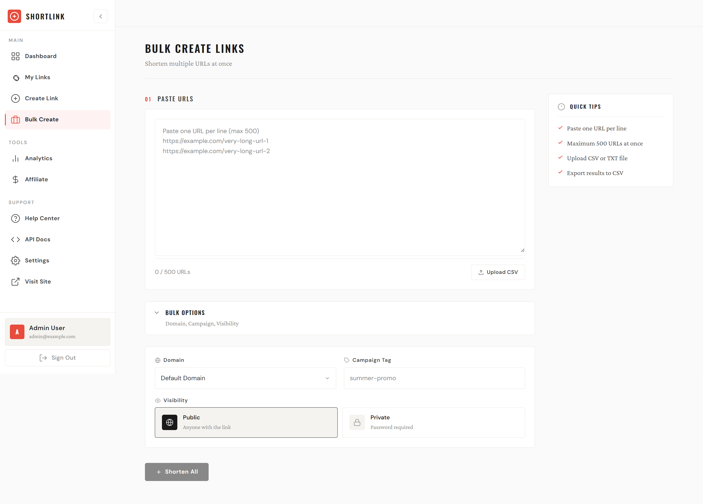
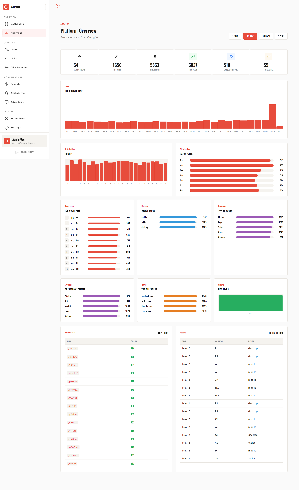
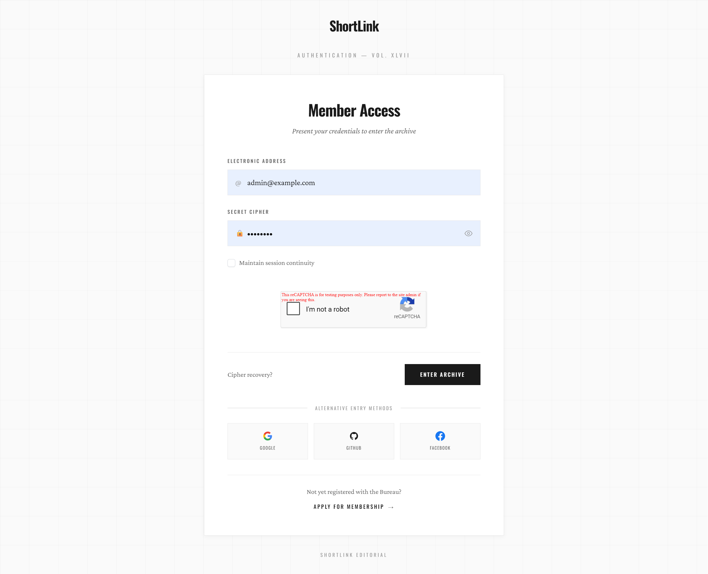
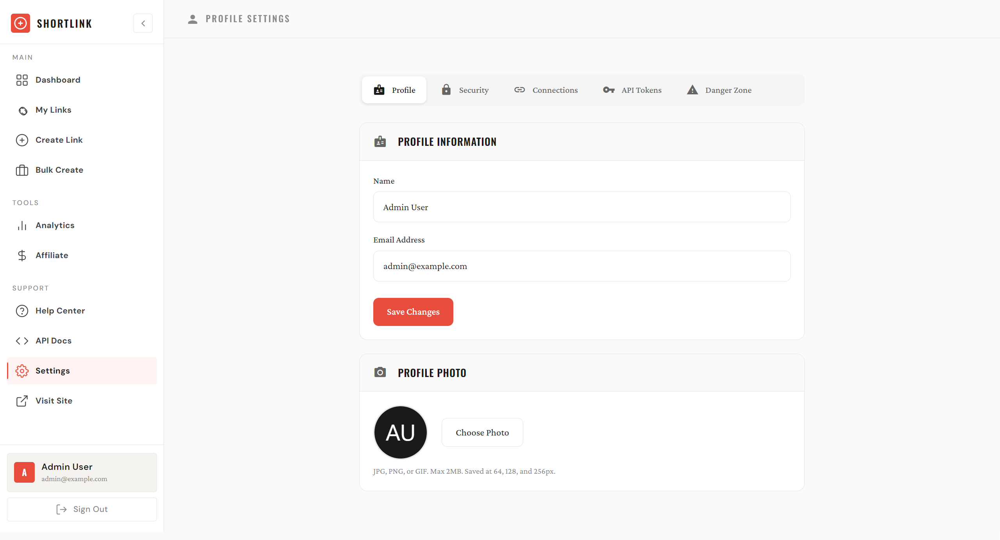
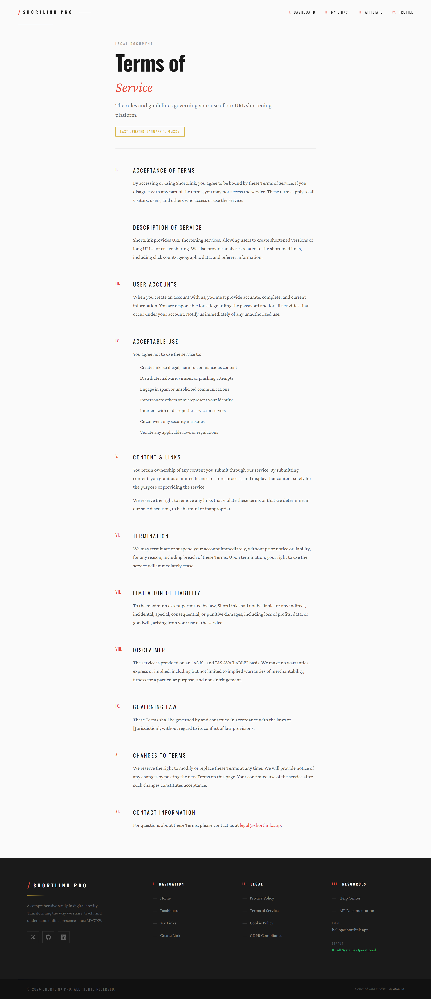

<!-- © Atia Hegazy — atiaeno.com -->

<p align="center">
  
</p>

<h1 align="center">ShortLink PRO</h1>
<h3 align="center">Enterprise-Grade URL Shortener SaaS Platform</h3>
<p align="center">Advanced URL shortening with affiliate monetization, real-time analytics, REST API, and comprehensive admin panel</p>

<p align="center">
  
  
  
  
  
  
  
</p>

---

## 🖼️ Project Overview

<p align="center">
  
</p>

### User Dashboard & Features

| User Dashboard | Create Link | My Links |
|:-------------:|:-----------:|:--------:|
|  |  |  |

### Analytics & Insights

| Analytics Overview | Per-Link Analytics | Bulk Create |
|:----------------:|:------------------:|:-----------:|
|  |  |  |

### Affiliate System

| Affiliate Program | Affiliate Dashboard | Admin Analytics |
|:-----------------:|:-------------------:|:---------------:|
|  |  |  |

---

## 🏗️ Architecture Overview

<p align="center">
  
</p>

```
┌─────────────────────────────────────────────────────────────────────────────┐
│                              ShortLink PRO Architecture                      │
├─────────────────────────────────────────────────────────────────────────────┤
│                                                                              │
│  ┌─────────────┐    ┌─────────────┐    ┌─────────────┐    ┌─────────────┐  │
│  │   Vue.js    │    │   Vue.js    │    │   Vue.js    │    │   Vue.js    │  │
│  │  Dashboard  │    │   Admin     │    │  Affiliate  │    │    Auth     │  │
│  └──────┬──────┘    └──────┬──────┘    └──────┬──────┘    └──────┬──────┘  │
│         │                  │                  │                  │         │
│         └──────────────────┴────────┬─────────┴──────────────────┘         │
│                                     │                                       │
│                              ┌──────▼──────┐                                │
│                              │   Laravel   │                                │
│                              │     12.x    │                                │
│                              └──────┬──────┘                                │
│                                     │                                       │
│    ┌───────────────────────────────┼───────────────────────────────┐       │
│    │                               │                               │       │
│ ┌──▼───┐  ┌─────────┐  ┌─────────┐ │ ┌─────────┐  ┌─────────┐  ┌──▼───┐  │
│ │ MySQL │  │  Redis  │  │  Queue  │ │ │  Jobs   │  │  Cache  │  │OAuth │  │
│ │ 8.0+  │  │ Caching │  │ Workers │ │ │ (OG/SEO)│  │ Redirect│  │ 2FA  │  │
│ └───────┘  └─────────┘  └─────────┘ │ └─────────┘  └─────────┘  └───────┘  │
│                                                                              │
└─────────────────────────────────────────────────────────────────────────────┘
```

---

## 🚀 Key Features

### 🔗 URL Shortening Engine
| Feature | Description |
|---------|-------------|
| **Custom Aliases** | Memorable short URLs (3-50 chars, alphanumeric) |
| **Guest Shortening** | Anonymous link creation (rate-limited 30/min/IP) |
| **Password Protection** | Private links with password access |
| **Expiration Dates** | Time-based link expiry |
| **Campaign Tags** | UTM-compatible campaign tracking |
| **Bulk Operations** | Create up to 500 links via CSV upload |
| **Multi-Domain** | Unlimited branded short domains |

### 📊 Advanced Analytics
| Metric | Implementation |
|--------|----------------|
| **Real-time Clicks** | <30 second delay, live tracking |
| **Geographic Data** | Country + city-level location |
| **Device Tracking** | Mobile, desktop, tablet breakdown |
| **Browser Analytics** | Chrome, Safari, Firefox, etc. |
| **Referrer Tracking** | Traffic source attribution |
| **OS Detection** | Windows, macOS, Linux, iOS, Android |
| **Daily Aggregation** | Optimized daily summary tables |

### 💰 Affiliate Monetization System

<p align="center">
  
</p>
- **Tiered Commissions** - Bronze, Silver, Gold tiers with thresholds
- **Country-Specific Rates** - Custom rates per geographic region
- **Payout Management** - PayPal integration with audit logs
- **Earnings Dashboard** - Real-time stats with sync functionality

### 📱 QR Code System
- SVG & PNG formats with customizable colors
- Direct download or embed in pages
- Batch generation support

### 🔌 REST API
```bash
# Authentication
curl -H "Authorization: Bearer YOUR_API_TOKEN" \
  https://api.shortlink.pro/api/v1/links

# Create Link
POST /api/v1/links
{
  "url": "https://example.com",
  "alias": "my-custom-code",
  "domain_id": 1
}

# Get Analytics
GET /api/v1/links/{id}/analytics?period=week
```
- Full CRUD operations
- Token-based authentication
- Rate limiting (1000/hour)
- Webhook support

### 🔍 SEO Indexing Integration
- **Google Indexing API** - Instant URL submission
- **IndexNow Protocol** - Bing/Yandex instant notification
- **XML Sitemap Ping** - Traditional search engine submission
- **Configurable Intervals** - Hourly/daily scheduling

### 📢 Advertising System
- **Ad Management** - Create ads with title, URL, image
- **Per-Link Overrides** - Inherit, disable, or force specific ads
- **Performance Tracking** - Impression & click analytics

### 👥 User Management
- **Roles** - Admin, User with permission system
- **OAuth** - Google, GitHub, Facebook login
- **2FA** - Two-factor authentication
- **CAPTCHA** - Google reCAPTCHA protection
- **Email Verification** - Disposable email blocking

### 🛡️ Security & Compliance
- **GDPR** - IP anonymization, data retention controls
- **Rate Limiting** - Dynamic throttling per endpoint
- **Input Validation** - URL sanitization & security checks
- **CSRF/XSS Protection** - Built-in Laravel security
- **Audit Logging** - Full activity tracking

---

## 👤 User Authentication & Profile

| Login | Profile Settings | Terms of Service |
|:-----:|:----------------:|:----------------:|
|  |  |  |

---

## 🎛️ Admin Panel

Comprehensive admin dashboard for complete platform management.

### Admin Dashboard & Link Management

| Admin Dashboard | All Links | Link Details |
|:---------------:|:---------:|:------------:|
|  |  |  |

### Monetization & Advertising

| Affiliate Tiers | Payout Management | Advertising |
|:---------------:|:-----------------:|:-----------:|
|  |  |  |

### System Management

| Report Queue | SEO Indexer | Settings |
|:------------:|:-----------:|:--------:|
|  |  |  |

---

## 🔌 REST API & Documentation

<p align="center">
  
</p>

```bash
# Authentication
curl -H "Authorization: Bearer YOUR_API_TOKEN" \
  https://api.shortlink.pro/api/v1/links

# Create Link
POST /api/v1/links
{
  "url": "https://example.com",
  "alias": "my-custom-code",
  "domain_id": 1
}

# Get Analytics
GET /api/v1/links/{id}/analytics?period=week
```

---

## 💻 Technical Implementation

### Database Schema Design
```sql
-- Core Links Table with optimized indexes
links (
    id, user_id, domain_id, short_code [UNIQUE INDEX],
    destination_url, custom_alias, campaign_tag,
    visibility, password, clicks_count,
    expires_at, is_active, created_at, updated_at
)

-- Daily Analytics Aggregation (performance optimization)
link_analytics_daily (
    link_id, date [INDEX],
    total_clicks, by_device JSON, by_country JSON,
    by_browser JSON, by_referrer JSON
)

-- Affiliate System with country rates
affiliate_tiers (
    id, name, visit_threshold, commission_rate,
    view_rate, view_multiplier, is_active
)

affiliate_country_rates (
    affiliate_tier_id, country_code, commission_rate
)

affiliate_stats (
    affiliate_id, affiliate_tier_id,
    visits, earnings [INDEXED for fast queries]
)
```

### Performance Optimizations
| Optimization | Implementation |
|--------------|----------------|
| **Redirect Caching** | Redis with domain-scoped keys |
| **Daily Aggregation** | Pre-computed analytics tables |
| **Queue Processing** | Background jobs for OG tags & SEO |
| **Database Indexing** | Composite indexes on frequently queried columns |
| **Eager Loading** | Relationships preloaded to avoid N+1 |
| **Cache Invalidation** | Domain-keyed cache with TTL |

### Caching Strategy
```
┌─────────────────────────────────────────────────────────────┐
│                    Redirect Cache Flow                       │
├─────────────────────────────────────────────────────────────┤
│                                                              │
│  Request → Check Redis Cache (domain:code)                  │
│       │                                                     │
│       ├── HIT → Return cached URL (sub-millisecond)         │
│       │                                                     │
│       └── MISS → Query DB → Cache result (24h TTL)          │
│                  → Return URL                               │
│                                                              │
└─────────────────────────────────────────────────────────────┘
```

---

## 🛠️ API Endpoints

### Authentication
| Method | Endpoint | Description |
|--------|----------|-------------|
| POST | `/api/v1/auth/register` | User registration |
| POST | `/api/v1/auth/login` | User login |
| POST | `/api/v1/auth/logout` | User logout |

### Links
| Method | Endpoint | Description |
|--------|----------|-------------|
| GET | `/api/v1/links` | List all links |
| POST | `/api/v1/links` | Create new link |
| GET | `/api/v1/links/{id}` | Get link details |
| PATCH | `/api/v1/links/{id}` | Update link |
| DELETE | `/api/v1/links/{id}` | Delete link |

### Analytics
| Method | Endpoint | Description |
|--------|----------|-------------|
| GET | `/api/v1/links/{id}/analytics` | Link analytics |
| GET | `/api/v1/analytics` | Global analytics |

### Affiliate
| Method | Endpoint | Description |
|--------|----------|-------------|
| GET | `/api/v1/affiliate` | Affiliate profile |
| POST | `/api/v1/affiliate/enroll` | Enroll in program |
| GET | `/api/v1/affiliate/tiers` | Available tiers |
| POST | `/api/v1/affiliate/payout` | Request payout |

### Domains
| Method | Endpoint | Description |
|--------|----------|-------------|
| GET | `/api/v1/domains` | List domains |
| POST | `/api/v1/domains` | Create domain |
| PATCH | `/api/v1/domains/{id}` | Update domain |
| DELETE | `/api/v1/domains/{id}` | Delete domain |

---

## ⚙️ Requirements

| Requirement | Version | Description |
|-------------|---------|-------------|
| **PHP** | 8.2+ | Server-side runtime |
| **MySQL** | 8.0+ | Primary database |
| **Redis** | 6.0+ | Caching & queues |
| **Node.js** | 18+ | Frontend build |
| **Composer** | 2.x | PHP package manager |

---

## 🚦 Installation

### 1. Clone & Setup

```bash
git clone https://github.com/atiahegazy/url-shortener.git
cd url-shortener
composer install
npm install
```

### 2. Environment Configuration

```bash
cp .env.example .env
php artisan key:generate
```

Configure your `.env`:
```env
APP_NAME="ShortLink PRO"
APP_URL=http://localhost:8000

DB_CONNECTION=mysql
DB_HOST=127.0.0.1
DB_PORT=3306
DB_DATABASE=shortlink_pro
DB_USERNAME=root
DB_PASSWORD=your_password

REDIS_HOST=127.0.0.1
REDIS_PORT=6379

# OAuth (optional)
GOOGLE_CLIENT_ID=
GOOGLE_CLIENT_SECRET=
GITHUB_CLIENT_ID=
GITHUB_CLIENT_SECRET=
```

### 3. Database Setup

```bash
mysql -u root -p -e "CREATE DATABASE shortlink_pro CHARACTER SET utf8mb4 COLLATE utf8mb4_unicode_ci;"
php artisan migrate --seed
```

### 4. Build & Run

```bash
npm run build
php artisan serve
# In another terminal:
php artisan queue:listen
```

---

## 🐳 Docker Deployment

### Production Setup
```bash
docker-compose up -d
docker-compose exec app php artisan migrate --force
docker-compose exec app php artisan db:seed --class=Database\\Seeders\\Production\\DatabaseSeeder
```

### Services
| Service | Description |
|---------|-------------|
| **app** | PHP-FPM + Laravel |
| **nginx** | Web server |
| **mysql** | Database |
| **redis** | Cache & queues |
| **supervisor** | Process manager |

---

## 🧪 Testing

```bash
composer run test
```

**Test Coverage**: 156+ tests passing ✅

### Test Categories
- Unit Tests (Services, Models)
- Feature Tests (API, Controllers)
- Integration Tests (Database, Cache)

---

## 📦 Project Structure

```
├── app/
│   ├── Http/Controllers/    # API & Web controllers
│   ├── Models/              # Eloquent models
│   ├── Services/            # Business logic
│   ├── Jobs/                # Queue jobs
│   └── Policies/            # Authorization
├── database/
│   ├── migrations/          # Schema definitions
│   └── seeders/             # Sample data
├── routes/
│   ├── api.php              # REST API routes
│   └── web.php              # Web routes
├── resources/
│   └── js/                  # Vue.js components
└── tests/                   # Test suites
```

---

## 🔐 Security Checklist

- [ ] Change default admin password
- [ ] Set strong APP_KEY
- [ ] Enable HTTPS/SSL
- [ ] Set APP_DEBUG=false
- [ ] Configure firewall
- [ ] Review rate limits
- [ ] Enable backups

---

## 📄 License

MIT License - See [LICENSE](LICENSE) for details.

---

<p align="center">
  
</p>

---

<p align="center">
  <strong>ShortLink PRO</strong> — Built with ❤️ by <a href="https://atiaeno.com">Atia Hegazy</a><br>
  <sub>Senior Full-Stack Developer | Laravel & Vue.js Specialist</sub>
</p>
